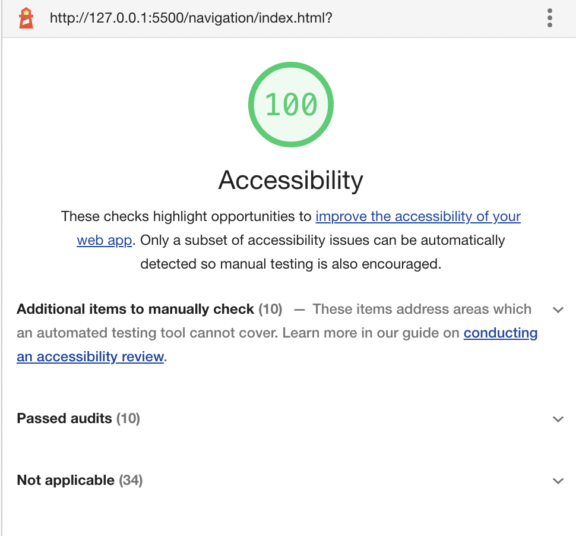

# a11y-examples

1. Se ejecuto el reporte lighthouse en donde se obtubieron los siguientes resultados:

.png)
Para resolver los problemas primero se reviso el boton submit.

.png)
En donde se puede ver que toca cambiar el color de la letea a uno más oscuro o cambiar el color del fondo, por lo cual se decidio cambiar el color de fondo y se reviso que este si fuera el adecuado.

.png)
Al ver que si se modifico el color en el .css, y se le añadio un texto alternativo a la imagen. Despues se volvio a correr el reporte lighthouse con el siguiente resultado:

